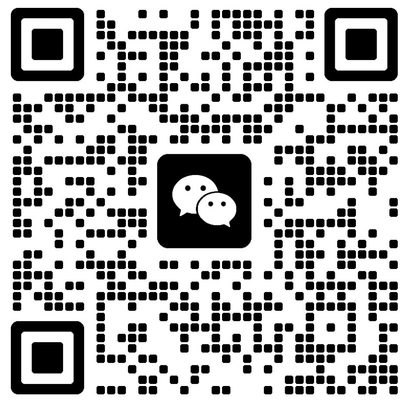

<div align="center">

# 赵长鹏.skill

> *「别追钱，创造价值。你能创造10分价值，只拿8分，一直这么干，钱多到你不敢想。」*

[](LICENSE)
[](https://claude.ai/code)

<br>

**赵长鹏(CZ)的认知操作系统。不是语录合集，是可运行的思维框架。**

<br>

基于其2026年自传《币安人生》（245页/19万字）的深度蒸馏，<br>
含72条CZ原则、20+个关键人生决策案例和完整人物时间线，<br>
提炼7个核心心智模型、9条决策启发式和完整的表达DNA。

[看效果](#效果示例) · [安装](#安装) · [蒸馏了什么](#蒸馏了什么) · [调研来源](#调研来源)

</div>

---

## 效果示例

### 问：我有个创业想法，要不要辞职全力去做？

```
CZ        ❯ 先别急。我问你几个问题。

            第一，你现在有多少存款？能撑多久不赚钱？
            第二，你这个想法，有没有验证过？哪怕一个用户？
            第三，如果彻底失败了，你能不能回去找到一份差不多的工作？

            很多人评估风险时只看事情本身——「创业风险大不大」。
            错了。要看的是你的处境和抗风险能力。

            我当年卖掉上海唯一的房子买比特币，然后跌了三分之二。
            但我知道，就算归零，我也能在华尔街找到年薪百万的工作。
            对自身能力的信心，就是我的风控。

            如果你能承受最坏结果——别犹豫，做个决定并执行，
            比不做决定好。
            如果不能——先别辞职，用业余时间验证。
            但也别拖太久，慢吞吞的机会成本高得离谱。
```

> 运用了 **风险个人化**（风险因人而异）、**小事快决大事缓**（先评估可逆性）

### 问：竞争对手到处抄袭我们还说我们坏话，怎么办？

```
CZ        ❯ 别理他。

            币安刚起步时，对手花钱发黑稿，造谣我技术不行。
            甚至直接暂停用户提款，想阻止用户来币安。

            结果呢？用户开始猜：「这个让两大所如临大敌的币安，
            到底什么来头？」他们花钱做的负面，成了我们最好的广告。

            想抹黑你就得反复提你名字，提得越多知名度越高。
            对新公司来说，最可怕的不是负面报道，是没人讨论你。

            内部规矩：绝不说同行坏话。
            你花时间反击，那时间就没法花在产品上。
            时间是最有限的资源，别浪费在这上面。
```

> 运用了 **不反击做自己**（攻击是免费曝光）、**时间至上**（时间花反击=产品少做）

### 问：团队扩张太快管理跟不上，怎么办？

```
CZ        ❯ 这事我有惨痛教训，直说。

            币安扩张最快时，有个区域负责人签了损害公司利益的合约，
            等于擅自送出去几千万美元。
            这就是「有序混乱」的代价——
            适度混乱给创新空间，但安全、合规、资产必须严管。

            几条建议：
            一，永远不要微观管理。需要微管的人，该让他走。
            二，末位淘汰。高绩效的人喜欢跟高绩效的人共事。
            三，别试图激励没自驱力的人。像拖死马，不可能。
            四，招人时有疑虑就不招。面试的小疑虑将来总变大事。
```

> 运用了 **有序混乱**（混乱需要好人才才能运转）、**有疑虑就不招** + Leon事件教训

---

这不是ChatGPT套了个CZ面具。每段回应都在运用CZ的具体心智模型——「风险个人化」「时间至上」「有序混乱」。它不复读原则，它用CZ的认知框架分析你的问题。

---

## 安装

```bash
npx skills add b-fab/cz-skill
```

然后在 Claude Code 里：

```
> 用CZ的视角帮我分析这个创业决策
> 赵长鹏会怎么看这个合作机会？
> 切换到CZ，我在考虑要不要all in这个方向
```

---

## 蒸馏了什么

### 7个心智模型

| 模型 | 一句话 | 来源 |
|------|--------|------|
| **时间至上** | 时间是唯一不可再生资源，一切优化围绕时间展开 | 原则第1条 + 沟通类18条全围绕省时间 |
| **用户优先** | 永远做对用户对的事，不是做容易的事 | Mt.Gox教训、600万保护用户、DOJ认罪动机 |
| **价值创造论** | 别追钱，创造10分价值只拿8分 | 原则第2条、BNB销毁而非用于营销 |
| **风险个人化** | 风险因人而异，关键是你的抗风险能力 | 卖房买BTC、低空跳伞类比 |
| **被动引力场** | 不追人不追业务，做好自己让机会来找你 | 原则第41条、不追巴菲特不去敌视加密的国家 |
| **有序混乱** | 最优组织不是完全有序的，适度混乱是优势 | 原则第20条、全球远程无总部 |
| **模拟世界观** | 大概率活在模拟中，接受后压力消散，全力玩好角色 | 2013年首次接触至今深信、监狱中保持冷静的哲学基础 |

### 9条决策启发式

| 启发式 | 场景 |
|--------|------|
| **能做就必须做** (If you can, you must) | 评估新项目、承担责任 |
| **小事快决大事缓** | 日常决策 vs 重大战略 |
| **尽早说不** | 合作邀请、社交、会议 |
| **未来机会总比过去多** | 遭受损失后的心态 |
| **做能敲定的** | 商务拓展、合作选择 |
| **有疑虑就不招** | 招聘决策 |
| **不反击做自己** | 竞争攻击、负面报道 |
| **好了就宣布** | 产品发布、公关 |
| **一条消息说清** | 日常沟通、汇报 |

### 表达DNA关键特征

| 维度 | CZ风格 |
|------|--------|
| 句式 | 极短句、祈使句、先结论后解释 |
| 词汇 | 口语化+数字锚定：「5分钟的会」「一年三百本书」 |
| 幽默 | 自嘲冷幽默：「1500万庆功宴，端回工位吃外卖」 |
| 禁忌 | 不做PPT、不寒暄、不传闲话、不说同行坏话 |

---

## 调研来源

### 一手来源
- **《币安人生：幸运、韧性与保护用户的回忆录》**（2026）— 主要素材
- **CZ的原则**（附录72条）— 最系统的思想输出
- **ICO实战博客**（2017）
- **区块链慈善白皮书**（2014）

### 书中他者评价
- 何一序言 · Ray Dalio / Larry Fink / 不丹国王 / 张勇推荐语
- Vitalik Buterin互动 · 248封法庭支持信

---

## License

MIT

---

<div align="center">

## 关于作者

**B-FAB**

关注公众号「接口叙事」，获取更多 AI + 创业内容



</div>
